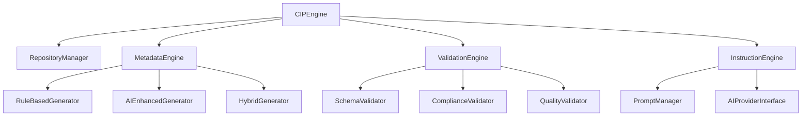
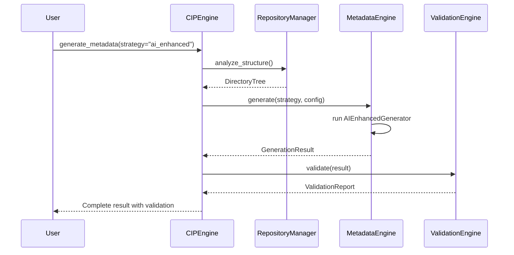

# CIP-Core Unified Architecture (v4)

> **Consolidated design document - supersedes v1, v2, and v3 architecture documents**

This document presents the unified architecture for CIP-Core, consolidating insights from previous versions while introducing a cleaner, more maintainable design.

---

## 🎯 **Design Principles**

### **1. Single Source of Truth**
- One CIPEngine class coordinates all operations
- Unified metadata system replaces scattered generators
- Centralized validation replaces multiple validator classes

### **2. Clear Separation of Concerns**
```python
# Clean interfaces
CIPEngine          # High-level coordination
├── RepositoryManager    # Repository state and operations  
├── MetadataEngine      # All metadata generation
├── ValidationEngine    # All validation processes
└── InstructionEngine   # AI instruction management
```

### **3. Plugin Architecture**
- Extensible generation strategies
- Pluggable validation rules
- Custom AI provider integration

---

## 🏗️ **Core Architecture**

### **System Overview**


---

## 🧠 **Core Components**

### **CIPEngine** - Central Coordinator
```python
class CIPEngine:
    """
    Main entry point for all CIP operations.
    Replaces: CIPAutomation, scattered CLI logic
    """
    
    def __init__(self, repo_path: str, config: Optional[CIPConfig] = None):
        self.repo = RepositoryManager(repo_path)
        self.metadata = MetadataEngine(self.repo)
        self.validation = ValidationEngine(self.repo)
        self.instructions = InstructionEngine(self.repo)
    
    # Primary Operations
    def initialize_repository(self, config: InitConfig) -> InitResult
    def generate_metadata(self, strategy: GenerationStrategy) -> GenerationResult
    def validate_repository(self, rules: ValidationRules) -> ValidationReport
    def generate_instructions(self, template: InstructionTemplate) -> InstructionResult
```

### **RepositoryManager** - Repository State
```python
class RepositoryManager:
    """
    Manages repository-level state and operations.
    Replaces: scattered path management, file discovery logic
    """
    
    def __init__(self, repo_path: str):
        self.path = Path(repo_path)
        self.config = self._load_config()
        self.structure = self._analyze_structure()
    
    # Core Methods
    def get_directory_structure(self) -> DirectoryTree
    def find_files_by_pattern(self, pattern: str) -> List[Path]
    def load_existing_metadata(self) -> Dict[str, Any]
    def detect_project_type(self) -> ProjectType
```

### **MetadataEngine** - Unified Metadata Generation
```python
class MetadataEngine:
    """
    Unified system for all metadata generation.
    Consolidates: DirectoryMetadataGenerator, AIEnhancedMetadataGenerator, 
                 template generation from schemas
    """
    
    def __init__(self, repo: RepositoryManager):
        self.repo = repo
        self.generators = {
            'rule_based': RuleBasedGenerator(),
            'ai_enhanced': AIEnhancedGenerator(),
            'hybrid': HybridGenerator()
        }
    
    def generate(self, strategy: str, config: GenerationConfig) -> GenerationResult:
        """Single interface for all metadata generation"""
        generator = self.generators[strategy]
        return generator.generate(self.repo, config)
```

### **ValidationEngine** - Comprehensive Validation
```python
class ValidationEngine:
    """
    Orchestrates all validation processes.
    Consolidates: ComplianceValidator, MetadataValidator, schema validation
    """
    
    def __init__(self, repo: RepositoryManager):
        self.repo = repo
        self.validators = [
            SchemaValidator(),
            ComplianceValidator(), 
            QualityValidator()
        ]
    
    def validate(self, rules: ValidationRules) -> ValidationReport:
        """Run comprehensive validation with configurable rules"""
        results = []
        for validator in self.validators:
            if rules.should_run(validator.name):
                results.append(validator.validate(self.repo))
        return ValidationReport(results)
```

---

## 📁 **File Structure & Data Flow**

### **Repository Structure**
```bash
your-repo/
├── .cip/
│   ├── core.yaml              # CIP configuration
│   ├── instructions_v2.0.yaml # AI instructions
│   └── meta.yaml              # Directory metadata config
├── meta.yaml                  # Root metadata  
├── map.yaml                   # Directory structure map
└── cognition/                 # Validation framework
    ├── validation_questions.yaml
    ├── validation_answers.yaml
    └── comprehension_log.json
```

### **Data Flow**


---

## 🤖 **AI Integration Architecture**

### **Provider-Agnostic Design**
```python
class AIProviderInterface(ABC):
    """Abstract interface for AI providers"""
    
    @abstractmethod
    def generate_description(self, context: FileContext) -> str
    
    @abstractmethod
    def enhance_metadata(self, metadata: Dict) -> Dict

# Implementations
class OllamaProvider(AIProviderInterface): ...
class OpenAIProvider(AIProviderInterface): ...
class AnthropicProvider(AIProviderInterface): ...
```

### **Prompt Management**
```python
class PromptManager:
    """Manages AI prompts and templates"""
    
    def load_prompt_template(self, name: str) -> PromptTemplate
    def customize_prompt(self, template: PromptTemplate, context: Dict) -> str
    def get_validation_prompts(self) -> List[ValidationPrompt]
```

---

## 🔄 **Migration from Previous Versions**

### **From v1 (Original CIP Protocol)**
- ✅ **Directory structure**: Maintained and enhanced
- ✅ **Validation questions**: Integrated into ValidationEngine
- ✅ **Cognition scoring**: Enhanced with multiple validation types
- 🔄 **File ingestion**: Now handled by RepositoryManager

### **From v2 (GPT Integration)**
- ✅ **Custom GPT support**: Maintained through AIProviderInterface
- ✅ **Prompt templates**: Managed by PromptManager
- ✅ **GitHub Actions**: Enhanced with new CLI structure
- 🔄 **System prompts**: Templated and configurable

### **From v3 (Metadata Architecture)**
- ✅ **meta.yaml structure**: Enhanced and standardized
- ✅ **Directory-level metadata**: Core feature of MetadataEngine
- ✅ **Semantic scope**: Part of enhanced metadata generation
- 🔄 **Multiple meta.yaml files**: Unified through RepositoryManager

---

## 🚀 **New Features in v4**

### **1. Plugin System**
```python
# Custom validation rules
class CustomValidator(ValidatorPlugin):
    def validate(self, repo: RepositoryManager) -> ValidationResult:
        # Custom logic
        pass

# Register plugin
engine.validation.register_plugin(CustomValidator())
```

### **2. Configuration Management**
```yaml
# .cip/core.yaml
cip_version: "4.0"
metadata:
  strategy: "hybrid"
  ai_provider: "ollama"
validation:
  enabled_rules: ["schema", "compliance", "quality"]
  quality_threshold: 0.8
ai_integration:
  provider: "ollama"
  model: "llama2"
  custom_prompts: "prompts/"
```

### **3. Enhanced CLI**
```bash
# New unified commands
cip init --type theory --ai-provider ollama
cip generate --strategy hybrid --validate
cip validate --rules schema,compliance
cip doctor --check-all
```

---

## 📊 **Performance & Scalability**

### **Lazy Loading**
- Metadata loaded on-demand
- File analysis cached between operations
- AI providers initialized when needed

### **Batch Operations**
- Process multiple repositories
- Parallel metadata generation
- Bulk validation reporting

### **Memory Management**
- Streaming for large repositories
- Configurable cache sizes
- Resource cleanup protocols

---

## 🔗 **Implementation Timeline**

### **Phase 1: Core Engine** (Current)
- [ ] Implement CIPEngine and RepositoryManager
- [ ] Create MetadataEngine with strategy pattern
- [ ] Build ValidationEngine framework

### **Phase 2: Migration** 
- [ ] Migrate existing functionality to new classes
- [ ] Update CLI to use CIPEngine
- [ ] Comprehensive testing of new architecture

### **Phase 3: Enhancement**
- [ ] Plugin system implementation
- [ ] Advanced AI integration features
- [ ] Performance optimizations

---

> **See Also:**
> - **Legacy architectures**: [`legacy/`](legacy/) 
> - **Implementation details**: [`../developer-guide/class-hierarchy.md`](../developer-guide/class-hierarchy.md)
> - **Migration guide**: [`../examples/migration-guides/`](../examples/migration-guides/)
